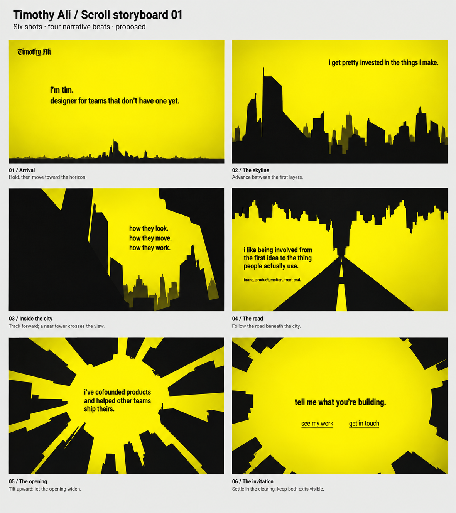

# Scroll storyboard 01

2026-09-08 · Proposed for review. The copy is accepted in 0024; the scene mapping below is new and is not yet an accepted decision.

## The journey

Arrive outside the city, enter it, move between its layers, find a road through it, look up into the radial architecture, and emerge into an open space for the invitation. Six shots carry the four accepted narrative beats. They are connected camera positions within one graphic world.

The same distinctive spired tower recurs from distant skyline to near silhouette to overhead edge, providing continuity. Buildings and the spaces between them create transitions. Text occupies readable openings and stays horizontal as the view changes.

The primary reference is the exact Do Androids Dream video recorded in 0022. Reference observations and source path are in `../dad-video-reference.md`. This is an adaptation of that world to the accepted introduction; the film's timings do not determine the site's scroll length.

## 01 — Arrival

**Narrative beat:** Meet tim.

**View:** An expansive yellow field with the Timothy Ali wordmark. A thin, distant city silhouette at the bottom hints at where scrolling will take us. This adapts the film's open title field to establish a destination immediately.

**Accepted copy:**
> i’m tim.  
> designer for teams that don’t have one yet.

**Camera:** Hold the opening composition while the introduction is readable. As the visitor scrolls, approach the distant skyline: buildings grow and separate into depth layers. No timed preroll.

**Text:** Intro in a clear area slightly left of center. The wordmark is a separate identity element in Jacquard 24. Exact scale and font for running text remain to be designed.

**Transition:** A recognizable spired tower grows into the left foreground; the yellow around it remains continuous into shot 02.

## 02 — The skyline

**Narrative beat:** What tim cares about, first passage.

**View:** Black skyline across the lower portion of the yellow field. A tall asymmetrical tower anchors one side; smaller silhouettes behind it give the city depth.

**Accepted copy:**
> i get pretty invested in the things i make.

**Camera:** Advance toward a gap between buildings with a slight sideways drift. Near shapes move faster than distant shapes. The gap becomes the route into shot 03.

**Text:** In an open sky pocket on the right. Give the sentence a readable stretch while movement is modest.

**Transition:** The near tower crosses part of the view and grows beyond its edges. The next passage appears once the gap opens.

## 03 — Inside the city

**Narrative beat:** What tim cares about, second passage.

**View:** Large silhouettes cut into the foreground. Distant layers remain visible through a yellow opening. This is the first unmistakable moment of being inside the architecture.

**Accepted copy:**
> how they look.  
> how they move.  
> how they work.

**Camera:** Move between the planes. One near building passes across the view while deeper layers remain slow. Keep the three lines grouped in a stable opening for reading; no requirement to make each phrase a separate scene.

**Text:** Horizontal, grouped, screen-readable in the yellow opening. Avoid making the words disappear behind architecture while they are meant to be read.

**Transition:** Pass beneath a broad silhouette. Its edge creates a natural visual transition into the overhead skyline of shot 04. This permits the film's inversion without requiring a full camera roll.

## 04 — The road

**Narrative beat:** How tim works.

**View:** A black road tapers toward a vanishing point beneath a hanging/inverted skyline, using the film's distinctive composition. Yellow openings at the sides provide reading space.

**Accepted copy:**
> i like being involved from the first idea to the thing people actually use.  
> brand, product, motion, front end.

**Camera:** Follow the road forward. The skyline is already overhead when we enter this space. Maintain a level reading orientation; the environment supplies the unusual perspective.

**Text:** In one generous side opening, with the range listed beneath the sentence. This is the longest passage and needs the longest readable stretch. The two passages may occupy successive holds within this shot if necessary.

**Transition:** As we approach the vanishing point, begin a gentle upward tilt. The overhead city becomes the perimeter of a yellow sky opening.

## 05 — The opening

**Narrative beat:** Why to believe tim.

**View:** Looking upward, long angular silhouettes extend inward from the frame edges around a large yellow opening. The same buildings now define a radial composition, closely informed by the film's later sequence.

**Accepted copy:**
> i’ve cofounded products and helped other teams ship theirs.

**Camera:** Complete the upward tilt, then let the central opening widen. Slow the movement around this passage so the experience claim lands clearly.

**Text:** In the broad yellow center. It stays level as the camera tilts. The optional company-name credit remains undecided and is omitted from this version's illustrated scene; it could be added as a subordinate line later.

**Transition:** Continue the gentle approach toward the opening. Buildings move toward the edges and release more yellow space for the final shot.

## 06 — The invitation

**Narrative beat:** A next step.

**View:** The opening expands into a generous yellow field framed by receding black architecture. It echoes the start, with the city now around the viewer. The journey ends somewhere the visitor can comfortably stay.

**Accepted copy:**
> tell me what you’re building.

**Accepted action labels:**
- see my work
- get in touch

**Camera:** Settle in the clearing. Both actions remain visible at the end of the scroll. The film's blackout is not carried into this proposed ending.

**Text:** Invitation and both destinations together in the open center. The destination is a meaningful reading/action state.

## How the sequence behaves

- Scroll controls position in the journey in both directions. Pausing scroll leaves a readable composition; the storyboard does not depend on a film playing to completion.
- Each shot includes a readable stretch and a transition to the next. Their relative lengths should follow the amount of copy and spatial movement; exact scroll percentages or durations are deliberately unassigned at this stage.
- Work and Contact remain directly accessible through a small consistent navigation treatment throughout, per 0023. The board omits navigation chrome to concentrate on the journey; those routes must exist in the eventual design.
- Narrative copy stays horizontal. The world can tilt and invert around it. Exact text anchoring will be worked out after the storyboard direction is settled.
- No project images or detailed case studies appear in this landing journey, per 0023. Selected work is reached through the Work destination.
- The film's human figure is omitted from this proposed sequence: the visitor's camera position supplies a viewpoint within the world. Including a figure later would be a separate creative choice; this is not an accepted exclusion.

## What to review

The main new choices are: entering the city before the road; using six shots for four narrative beats; reaching the inverted skyline through architectural occlusion instead of a full camera roll; tilting upward for the founder-proof passage; and ending in the expanded yellow opening with the invitation. Review these spatial choices before refining font sizes, color values, motion details, or implementing the site.

## Visual board

`storyboard-01.png` illustrates the proposed composition and sequence. It is generated concept art using the supplied source-frame contact sheet as reference. Narrative text placement is indicative; the accepted text quoted in this document is authoritative. Any illustrative wordmark is a stand-in for the actual Jacquard 24 setting, and the running sans is not a new type-system decision.

Generation uses the built-in image generation tool. The complete prompt is saved alongside this document as `storyboard-01-prompt.txt`.

## Review of generated board

Visually inspected all six panels: the narrative sentences and action labels are present, captions are legible, panels are complete, and the intended progression is visible. The illustrative wordmark is not an exact Jacquard 24 rendering. The road panel gives the longer sentence more lines, as intended. This is a static composition review; camera continuity and reading intervals remain to be tested in a later motion study after direction approval.
