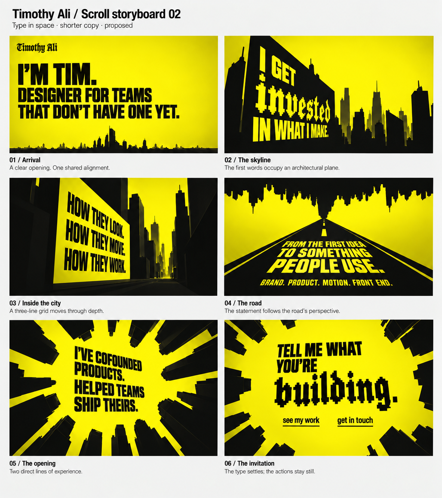

# Scroll storyboard 02

2026-09-08 · Revised concept proposal. Typography direction follows Timothy's explicit feedback, recorded in 0026. Exact shortened wording, heavy sans family, emphasis words, projected text planes, and scene mapping remain proposals.

## Direction

Text shares the geometry of the world. Each group has a local rectangular grid with consistent alignment and baseline spacing. The whole grid can occupy a plane in the scene and recede toward the same vanishing point as nearby architecture. Text can rotate and foreshorten coherently with its plane. This replaces the first board's assumption that all narrative remains level with the screen.

A heavier condensed grotesk carries primary display passages. Jacquard 24 is used for selected emphasis, proposed here on **invested** and **building**, as well as the Timothy Ali wordmark. Casing is a design choice; the personal voice is retained through the wording. The exact working sans remains undecided.

The board uses the six-shot camera journey from version 01 as a working structure, without treating that journey as approved.

## Scene notes

| Shot | Text and grid | Relationship to the camera |
|---|---|---|
| 01 Arrival | Intro and supporting positioning share a leading edge. Heavier, larger frontal type above the distant skyline. | Establish a clear opening before depth increases. |
| 02 Skyline | Yellow type occupies a black architectural face. “invested” is the blackletter emphasis; all lines share the face's projected margin. | The plane foreshortens with the building as we approach. |
| 03 Inside the city | Three equally structured lines occupy a shared yellow plane, aligned with the surrounding scene geometry. | Camera passes the plane; baselines and edges share its vanishing point. |
| 04 Road | The shortened statement lies on the road's receding plane. The disciplines form a subordinate line. | Type grows as we advance. The readable moment should be near enough to avoid excessive foreshortening. |
| 05 Opening | Two concise experience statements follow one alignment within the radial architecture. | Shallower perspective gives this passage a clear reading moment as the camera looks upward. |
| 06 Invitation | Condensed display plus Jacquard on “building”. The final grouping settles nearly frontal. | Actions stay stable and readable at the destination. |

## Grid proposal

Use a consistent column-and-baseline logic for the text groups, then project that local grid onto a scene plane. Match projected left edges and line spacing within each group. The image indicates this relationship; it does not define final grid dimensions or mathematically validated projections.

Architecture can have dramatic depth while a reading plane is comparatively shallow. The text does not need the maximum available angle in every shot. The opening and closing are useful places to settle the composition.

Navigation remains directly accessible through the journey, per 0023. It can keep a stable screen position while narrative text occupies the world; the storyboard focuses on narrative and omits navigation chrome.

## Copy

Read `../landing-copy-v2.md` for the proposed shorter wording and edit rationale. Original accepted wording remains in `../landing-copy-v1.md`. These edits respond to Timothy's concern about wordiness and have not yet been approved.

## Visual review and remaining choices

Reviewed the generated sheet: six complete panels, correct proposed sentences and action labels, heavier display hierarchy, blackletter emphasis on two words, and visible perspective in shots 02–04. The opening and invitation retain shared text alignments.

The generated letterforms approximate the intended font roles. They are not a verified rendering of Jacquard 24 or a chosen licensed heavy sans. The image also gives a few architectural edges modeled depth; final environment fidelity remains governed by the flat-silhouette source video. Exact projective grids and camera continuity belong to the subsequent design/motion study.

Decision focus: whether the grid/perspective relationship and typographic contrast now express the intended direction, and whether the shorter middle passages retain Timothy's voice.

## Generation record

Built-in image generation, editing storyboard 01 with the DAD source contact sheet as an additional reference. Full prompt: `storyboard-02-prompt.txt`. Version 01 is preserved.
