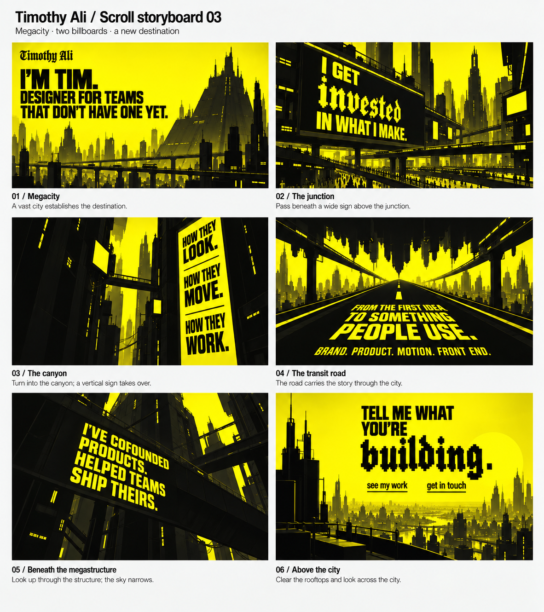
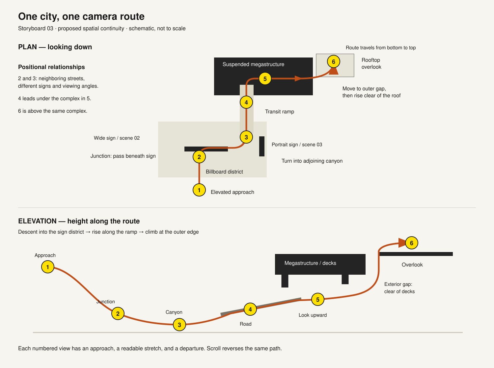

# Scroll storyboard 03 — one city, one route

2026-09-08 · Proposed spatial arrangement and transitions. Follows Timothy's requests for distinct billboard layouts, distinct final scenes, a futuristic dystopian megacity, and explicit positional continuity. The six frames are key views along one camera route. They are not six independent full-screen sections.

## The city and route

The route approaches a dense sign district from an elevated position, descends into a junction, turns into a narrower street canyon, joins an elevated transit ramp, passes beneath a suspended megastructure, and rises along its open outer edge to a rooftop overlook.

The wide sign in 02 and the vertical sign in 03 belong to adjacent streets in the same district. The road in 04 physically leads underneath the structure seen closely in 05. The platform in 06 belongs to that same complex, above the enclosing bridges. This makes the changes in composition consequences of position and direction of view.

Recurring landmarks:
- A stepped megastructure visible in the establishing skyline is the destination complex for 04–06.
- A thin antenna spire beyond the billboard district remains visible in gaps and reappears in the closing panorama.
- The billboard gantry of 02 and a connecting skybridge can be seen from the turn into 03.

The diagram is a proposed schematic, not a measured city plan. Scene illustrations guide composition; the route fixes the intended geography for a later motion study. Their exact geometry has not yet been demonstrated in an animated scene.

## Positional map

| Scene | Camera position | Camera looks toward | Main composition |
|---|---|---|---|
| 01 Megacity | Elevated approach south of the sign district | Forward across the district toward the destination megastructure | Open sky, enormous layered skyline |
| 02 Junction | Lower, above a large intersection | Forward and slightly left toward a wide gantry sign | Landscape billboard high in frame; infrastructure below |
| 03 Canyon | Around a right-hand bend and closer to street level | Along the narrow street, slightly upward toward its right-side sign | Tall portrait billboard and vertical enclosure |
| 04 Transit road | On a rising road leaving the canyon | Forward beneath the megastructure | Road vanishing point, hanging silhouettes overhead |
| 05 Understructure | At the far end of the ramp, within the support/bridge zone | Upward toward the bridge carrying the experience copy | Enclosed dark frame, narrow angular sky opening |
| 06 Overlook | Above the structure's roofline at its outer edge | Outward over the next expanse of the same city | Open horizontal panorama; invitation in clear sky |

## Transitions

### 01 → 02 — Approach and descend

Move forward toward the sign district while gently descending. Near towers grow faster than the distant skyline. A recognizable antenna spire remains on the same side of the route. The wide billboard is visible at a distance before its copy becomes the subject of 02.

The opening introduction stays legible during the initial approach, then leaves as its presentation plane passes out of view. The wordmark can reduce into the stable navigation identity; its exact behavior is still a design choice. The city remains present throughout the transition.

### 02 → 03 — Pass the sign, then turn the corner

After the wide billboard has had a readable stretch, travel beneath and past its gantry, descend slightly, and turn right into the adjoining canyon. The corner tower briefly covers the old sign. The new vertical sign appears on the opposite/right side ahead, then grows into the composition of 03.

This changes the layout along three axes: horizontal sign to portrait sign, left/top emphasis to right-side emphasis, elevated wide view to low upward view. Both signs physically exist in the same district; one does not morph into the other.

### 03 → 04 — Follow the canyon onto the ramp

Continue along the street past the vertical sign. Its near edge and a support column cross the view as the road bends toward a rising transit ramp. The ramp's lane marking becomes visible ahead before the new statement is readable. The camera levels out and follows that line toward the megastructure.

The text on the vertical sign remains attached to its local grid and moves out of view with the sign. The road statement becomes legible as the viewer approaches its plane. No cut or abstract transition screen is required.

### 04 → 05 — Follow the road under the structure, then look up

The road continues into the structure already visible overhead. The source film's “inverted skyline” is interpreted as the underside of a suspended city complex: stepped silhouettes hang downward from bridges and decks. The camera never has to roll upside down.

As the road copy passes beneath the camera, the forward movement eases. Tilt upward toward the large bridge/support face bearing the two experience statements. Nearby structure surrounds the view and reduces the sky to an off-center slit. Road, overhang, support columns, and experience sign are parts of the same place.

### 05 → 06 — Rise through the outer gap and clear the roofline

After the experience passage, move slightly outward toward an open vertical gap at the structure's edge. Rise along that exterior gap, keeping the route clear of bridge decks. A near parapet/roof edge passes downward through the frame as the city beyond is revealed. Ease the upward pitch back toward the horizon and settle just above the rooftop overlook.

This is a deliberate climb from within the infrastructure to above it, not a switch from a dark picture to a sunny picture. The antenna spire and layered skyline reconnect the closing panorama to 01. The closing invitation and actions enter their final reading position as the camera clears the edge.

The invitation can occupy a shallow scene plane just beyond the overlook, with the actions in a stable screen-aligned group. Its precise anchoring remains to be designed; both actions stay available once reached.

## Sequence rhythm

For every scene, use an approach, a readable stretch, then departure. Readability comes from a useful camera position and a stretch of gentle travel, rather than requiring a timed pause. Exact scroll lengths are open.

Scroll runs this route forward and backward. Reversing direction retraces positions, turns, and occlusions. Static environment geometry and scene-local text planes preserve continuity. Essential navigation stays accessible throughout.

The visual board uses proposed shorter copy v2 without further wording changes. Copy v1 remains the accepted text until the shortened wording receives approval.

## Art direction

An enormous futuristic city, slightly dystopian: dense stacked infrastructure, elevated routes, megastructures, antenna arrays, narrow streets, and monumental signage. The billboard district takes spatial cues from Times Square. The DAD yellow/black graphic language remains the rendering reference: use silhouette profiles and layered planes to communicate scale.

The generated board adds some windows, street activity, and modeled depth. These are illustrative density cues, not a decision to implement photorealistic buildings or crowds. The priority is retaining large legible shapes and strong spatial hierarchy as city scale increases.

Heavy display typography, local projected grids, and selective Jacquard emphasis from 0026 remain. The type in generated imagery is a stand-in for the actual font setting.

## Changes from storyboard 02

- 02 is a wide overhead sign across a large junction; 03 is a tall modular sign within a narrow canyon, on the other side of the view.
- 05 is an enclosed, mostly dark upward view; 06 is an open, yellow-dominant horizontal rooftop panorama.
- The previous large yellow circular ending is replaced by a rooftop destination for this proposal. The film's disc is optional background imagery rather than the camera's destination.
- One continuous city route now explains the sequence and the transitions.

## Review and provenance

Visually reviewed all six generated panels for copy, billboard distinction, camera orientation, final-scene contrast, and city scale. Main copy and actions are present. The final invitation remains legible against the open skyline. Diagram labels and spatial path are reviewed separately.

This is a static storyboard and proposed camera route, not an animated continuity test. The next motion study should check the corner turn, entry beneath the structure, and exterior climb using the same geometry across shots.

Image generation: built-in tool, using storyboard 02 and DAD source frames. Full prompt is saved in `storyboard-03-prompt.txt`. Route diagram is a deterministic SVG schematic. All previous versions are retained.
